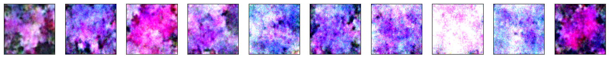
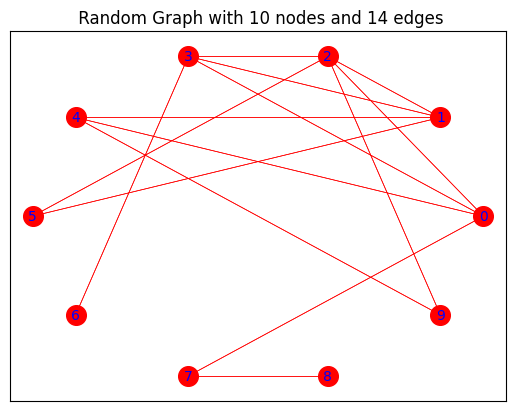
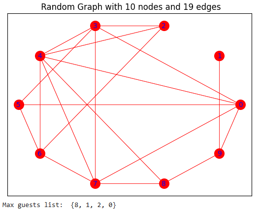

# 2023SK_Internship_Test
Entry test for research engineer internship position 

## Task #1 Applying the diffusion model for generating images of flowers

- Repository of diffusion model: https://github.com/cloneofsimo/minDiffusion
- Flower images dataset: https://www.robots.ox.ac.uk/~vgg/data/flowers/102/index.html

To replicate the results of the experiment: 
1. Open `task_1_flowers.ipynb` notebook inside `task_1` folder.

2. Go to `Step 1: Prepare the Dataset` and run all cells inside to load the trained model parameters `ddpm_flower.pth`.
    
3. To generate images of flowers using diffusion models, go to `Step 3: Generating the images with the trained diffusion model` and run corresponding cells.


<p align="center">
  
</p>
<p align="center">   
   <em> Fig.1 10 flower images from Flowers Dataset </em>
</p>

<p align="center">
  
</p>
<p align="center">   
   <em> Fig.2 10 flower images generated by diffusion model </em>
</p>


## Task #2 Graphs

To replicate the results of the experiment, do the following: 
1. Open `task_2_graphs.ipynb` notebook inside `task_2` folder in Google Colab.
    
2. Run all cells


The `task_2_graphs.ipynb` is implemented using `Graph` class, which contains the following methods: 

A. `.add_vertex()` - Adding a node with some information 

B. `.add_edge()` - Adding an edge between two nodes 

C. `.random_graph()` - Generating a random graph based on Erdos Renyl Model

D. `.adj_matrix_to_graph()` - To plot the resulting random graph using matplotlib


#### Part A: To generate and plot a random graph, execute the following code:

```
import graph 

obj = graph.Graph()
obj.random_graph(n=10, p=0.4)
obj.adj_matrix_to_graph()
```


<p align="center">
  
</p>
<p align="center">   
   <em> Fig.1 Random Graph </em>
</p>


#### Part B: Maximize number of guests list

>You are choosing, from a group of N number of friends, with whom to go for a picnic. However, persons linked with an edge are on very unfriendly terms with each other, so if both of them go to the picnic, it will be spoiled. To have as many friends as possible in the picnic, who should be invited?


<p align="center">
  
</p>
<p align="center">   
   <em> Fig.2 Maximum guest combination </em>
</p>


To solve the maximization problem, run `.invitation_list()` method to obtain the final list of nodes we should invite for a picnic. 
```
import graph 

obj = graph.Graph()
obj.random_graph(n=10, p=0.4)
obj.adj_matrix_to_graph()
obj.invitation_list()
```

<p align="center">
  
</p>
<p align="center">   
   <em> Fig.3 Maximum guest combination example </em>
</p>

Inside `task_2_graphs.ipynb` file you can find testing of algorithm on random graphs ( 5 - 10 pieces ) of varios sizes, drawing random graphs and showing the final list to the screen. 


## Task #3 BASH + Docker 


#### Part A: BASH

The `task_3` folder contains the following files:

- `task1_script.sh` script that counts each word frequency in the `dracula.txt` text file and shows the results on screen.

To implement: 

```
# navigate cd to the directory with script file and run following command:
./task1_script.sh

```


- `task2_script.sh` script takes 10 most frequent words and creates empty txt files in the specified folder. 

To implement:
```
# navigate cd to the directory with script file and run following command:
./task2_script.sh dracula.txt res_folder
```

- `dracula.txt` the text file on which we test above scripts 


#### Part B: Docker

- Step 1: Create a `Dockerfile` inside same directory with the above defined bash scripts. 
```
touch Dockerfile 
```

- Step 2: Add instructions in `Dockerfile` 
```

# getting base image ubuntu 

FROM ubuntu 

COPY . .

MAINTAINER bakhtiyar 

# uncomment the command to select which script you want to execute 
#CMD ["bash", "./task1_script.sh"]

#CMD ["bash", "./task2_script.sh", "dracula.txt", "output"]
```


- Step 3: Build `Dockerfile` to create an image

```
docker build -t ImageName:Tag directoryOfDockerfile
```


- Step 4: Run an image to create container 

```
docker run imageID
```


