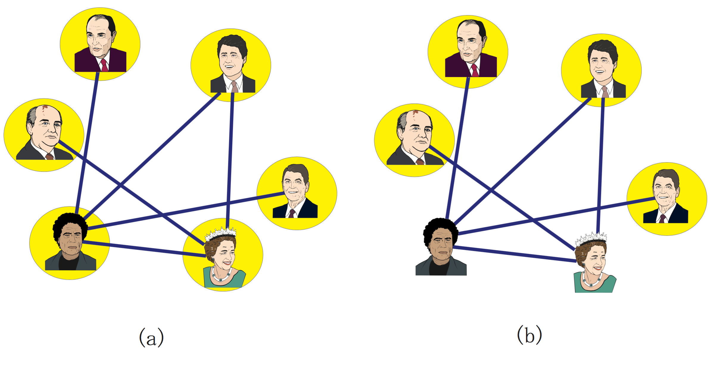

# 2023SK_Internship_Test
Entry test for research engineer internship position 

## Task #1 Applying the diffusion model for generating images of flowers

- Repository of diffusion model: https://github.com/cloneofsimo/minDiffusion
- Flower images dataset: https://www.robots.ox.ac.uk/~vgg/data/flowers/102/index.html

To replicate the results of the experiment, do the following: 
1. Open `task_1_flowers.ipynb` notebook inside `task_1` folder in Google Colab.

2. Go to `Step 1: Prepare the Dataset` and run all cells inside to load the trained model parameters `ddpm_flower.pth`.
    - `ddpm_flower.pth` - trained `ddpm` model parameters on $\approx$ 27% of Flowers Dataset with 100 epoches.
    
3. To generate images of flowers using diffusion models, go to `Step 3: Generating the images with the trained diffusion model` and run corresponding cells.


<p align="center">
  
</p>
<p align="center">   
   <em> Fig.1 10 flower images from Flowers Dataset </em>
</p>

<p align="center">
  
</p>
<p align="center">   
   <em> Fig.2 10 flower images generated by diffusion model </em>
</p>


## Task #2 Graphs

To replicate the results of the experiment, do the following: 
1. Open `task_2_graphs.ipynb` notebook inside `task_2` folder in Google Colab.
    
2. Run all cells


The `task_2_graphs.ipynb` is implemented using `Graph` class stored in `Graph.py`, which contains the following methods: 

A. `.add_vertex()` - Adding a node with some information 

B. `.add_edge()` - Adding an edge between two nodes 

C. `.random_graph()` - Generating a random graph based on Erdos Renyl Model

D. `.adj_matrix_to_graph()` - To plot the resulting random graph using matplotlib


#### Part A: To generate and plot a random graph, execute the following code:

```
g = Graph()
g.random_graph(n=10, p=0.4)
g.adj_matrix_to_graph()
g.invitation_list()
```


<p align="center">
  
</p>
<p align="center">   
   <em> Fig.1 Random Graph </em>
</p>


#### Part B: Maximize number of guests list

>You are choosing, from a group of N number of friends, with whom to go for a picnic. However, persons linked with an edge are on very unfriendly terms with each other, so if both of them go to the picnic, it will be spoiled. To have as many friends as possible in the picnic, who should be invited?


<p align="center">
  
</p>
<p align="center">   
   <em> Fig.1 Random Graph </em>
</p>
